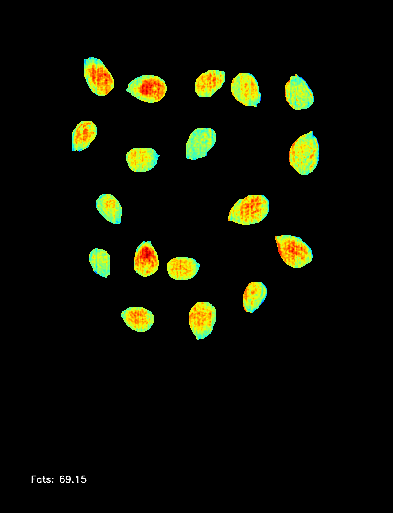
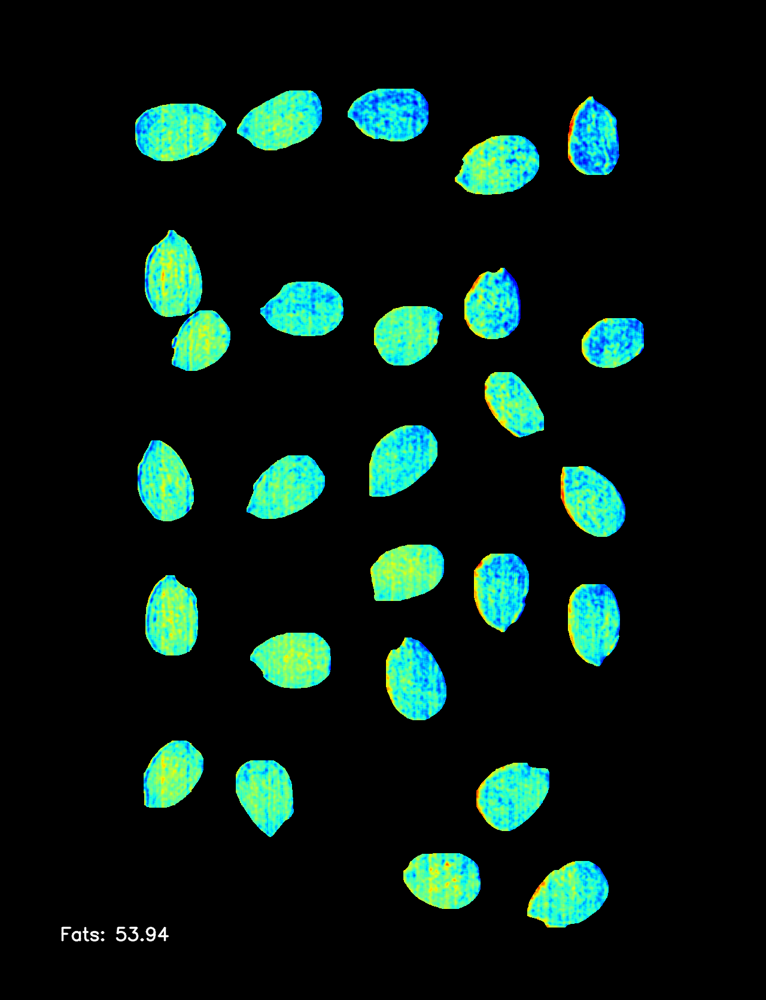
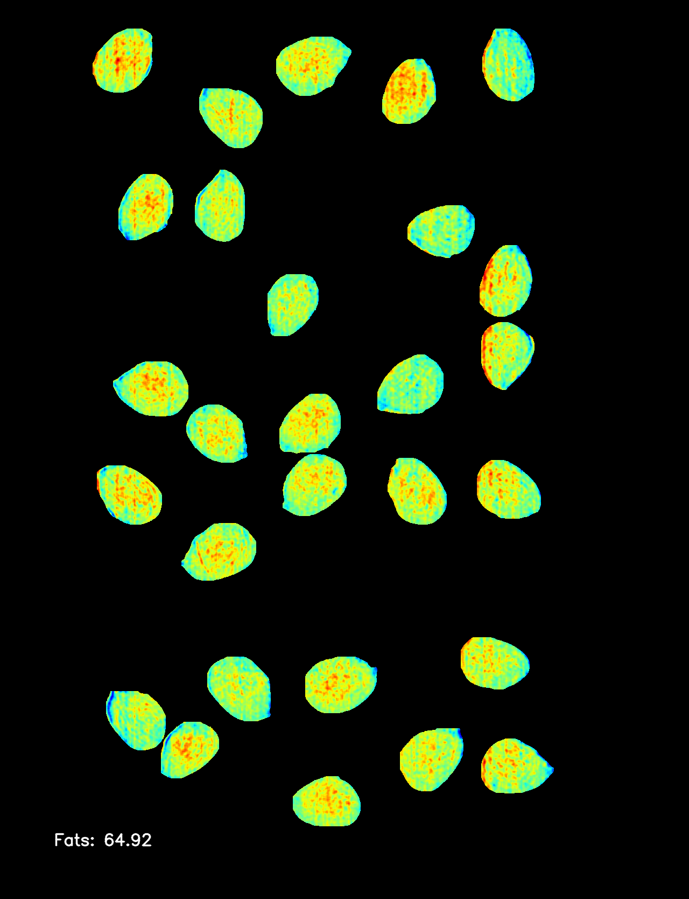

# Unlocking Almond Nutritional Breeding with Hyperspectral Imaging


## Overview

This repository provides an open-source implementation of the hyperspectral imaging workflow for nutritional composition analysis of almond kernels.

*Unlocking Almond Nutritional Breeding with Hyperspectral Imaging*

Fruit Breeding Group, Department of Plant Breeding, Centro de Edafología y Biología Aplicada del Segura - Spanish Research Council (CEBAS-CSIC), Campus Universitario Espinardo, E-30100 Murcia, Spain.

## Features

- Open-source Hyperspectral imaging workflow.
- AI-based segmentation using AlmondCV2.
- Automated image processing for kernel nutritional characterization.
- Reproducible methodology for research applications.

## Installation

To use this workflow, you can either clone the repository to work locally.
### Clone for local use:

```sh
git clone https://github.com/jorgemasgomez/almondcv3_hyp
cd your-repository-name
pip install -r requirements.txt
```


## Example Images

Disclaimer: The picture files in the "images" folder are not covered by the same GPL-3.0 license as the source code. These data files are dedicated to the public domain under CC-by-4.0 Creative Commons Attribution 4.0 International.

### Almond processed by the workflow

Mas-Gómez, J., Rubio, M., Dicenta, F., & Martínez-García, P. J. 2025. *Unlocking Almond Nutritional Breeding with Hyperspectral Imaging.*

<div align="center">
  
  
  
</div>


## Citation

If you use this workflow in your research, please cite:


## License

This project is licensed under the GNU GPL v3

